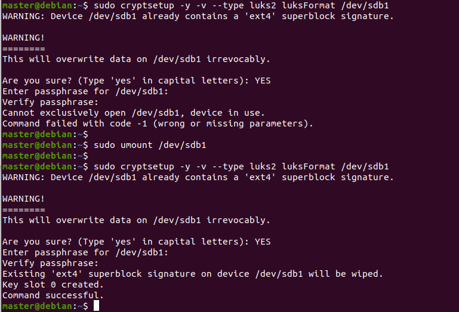
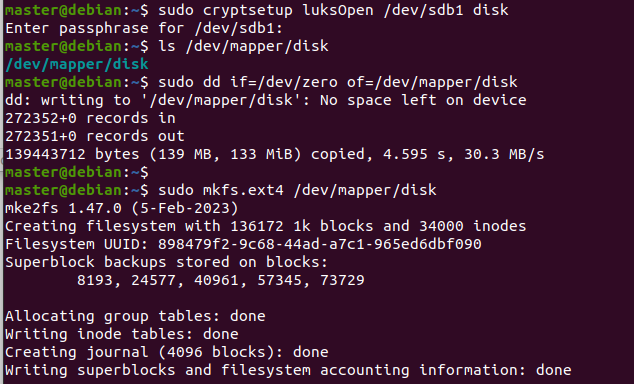
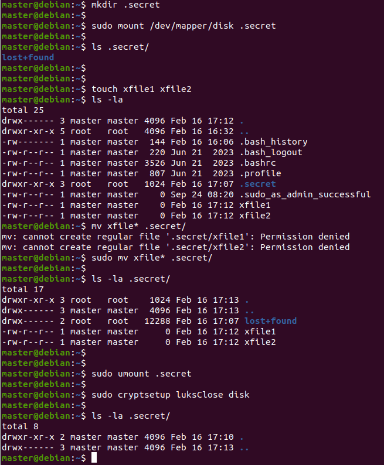

# Домашнее задание к занятию "`Защита хоста`" - `Аблогин Павел`

### Задание 1

1. `Установил eCryptfs`
2. `Добавил пользователя cryptouser`
3. `Зашифровал домашний каталог пользователя с помощью eCryptfs`

`Скриншоты выполнения задания 1`

---

### Задание 2

1. `Установил поддержку LUKS`
2. `Создал раздел /dev/sdb1 на 150 Мб`
3. `Зашифровал созданный раздел с помощью LUKS`

`Скриншоты выполнения задания 2`

---

